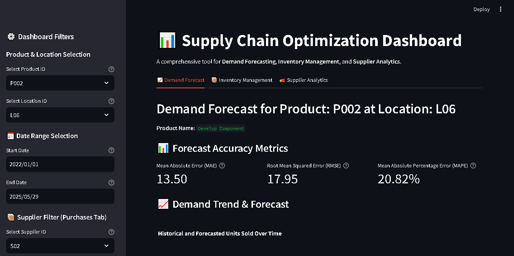
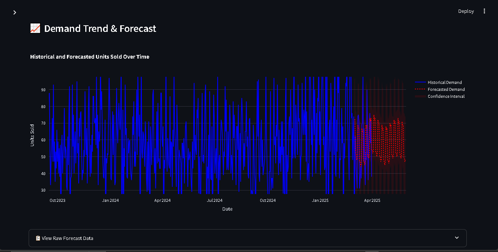
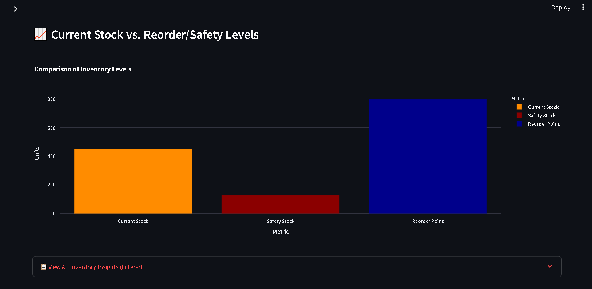

# Supply Chain Optimization Dashboard

[Dashboard App](https://supply-chain-dashboard-fppecphmqqsatcchdwfqxy.streamlit.app)

## Project Overview

This project provides an interactive dashboard for optimizing supply chain operations. 
It covers **Demand Forecasting**, **Inventory Management**, and **Supplier Analytics** to help businesses 
make informed decisions regarding stock levels, future demand, and supplier performance.

The dashboard uses simulated data to demonstrate key functionalities.

## Key Features

* **Demand Forecasting:** Visualize historical demand and future predictions with accuracy metrics.
  
* 
  
* **Inventory Management:** Track current stock, calculate optimal safety stock, reorder points, and reorder quantities.
* **Supplier Analytics:** Monitor supplier performance, including on-time delivery rates and average lead times.
* **Interactive Filters:** Analyze data by product, location, supplier, and custom date ranges.

* 

## Technology Stack

* **Python:** Core programming language
* **Pandas:** Data manipulation
* **Prophet:** Time series forecasting
* **Streamlit:** Interactive web dashboard
* **Plotly:** Data visualization

## About the Maintainer

This project is actively maintained by SATHVIKA KALAPALA, a Data Analyst with 3+ years of experience in transforming raw, messy data into automated pipelines and decision-ready dashboards. Sathvika specializes in SQL, Python (Pandas/NumPy), Tableau/Power BI, and cloud data stacks (Snowflake, AWS, Databricks), consistently delivering measurable impact through data-driven solutions.

*   **LinkedIn:** [https://www.linkedin.com/in/sathvika-kalapala-63271512a](https://www.linkedin.com/in/sathvika-kalapala-63271512a)
*   **Email:** sathvika.kalapala1211@gmail.com